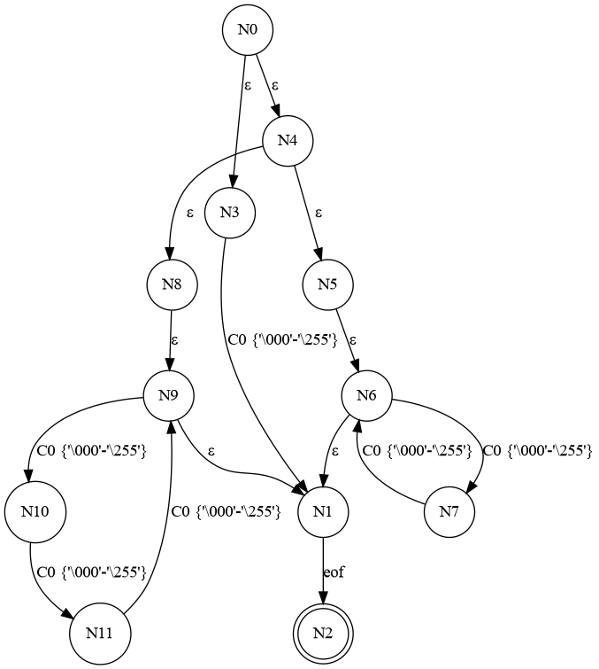

Exhausteve
==========

Exhausteve is an OCaml library and an executable that checks whether a
classic regular expression matches all strings i.e. is equivalent to `.*`.

Here's a hello-world example:

```
$ echo ".?.?.?.?|......+|[^h]....|.[^e]...|..[^l]..|...[^l].|....[^o]" | ./exhausteve
The provided regular expression is not exhaustive.
Here is an example of nonmatching input:
"hello"
```

The algorithm is a standard conversion of a regular expression tree
into an NFA and then into a DFA which is then visited breadth-first
until a missing state transition is found.

The only optimization is the conversion of the original alphabet
(bytes) into character classes that group equivalent characters. This
massively reduces the number of possible state transitions and speeds
up the NFA/DFA construction accordingly.

The implementation also includes a simple regexp parser using Ocamllex
and Menhir.

Suggested uses
--------------

- Study the source code for inspiration.
- Use the NFA implementation to implement Thompson's algorithm which
  matches a string efficiently in O(regexp size × string length).
- Use the DFA implementation to generate efficient source code for
  matching a regular expression.
- Use as a model to add a similar exhaustiveness check to ocamllex.

Build and test
--------------

Install [opam](https://opam.ocaml.org/) if you don't have it already
on your machine. Run `make setup` to install the dependencies.
Run `make` to build the library and the `exhausteve` executable.
Run `make test` to test, `make demo` for a demo.
Look into the makefile for more.

Graphs etc.
-----------

The regular expression `. | (..)* | (...)*` is designed to match strings
of length 0, 1, multiples of 2, and multiples of 3. The shortest strings
that are not matched are of length 5. Our tool should report such a
string as an example of nonmatching input and it does:

```
$ echo '. | (..)* | (...)*' | ./exhausteve
The provided regular expression is not exhaustive.
Here is an example of nonmatching input:
"\000\000\000\000\000"
```

`exhausteve` dumps the files `nfa.dot` and `dfa.dot` that when fed to
`dot` give us a visual representation of the automata.
I find them interesting in the case of `. | (..)* |
(...)*`.
Here's the NFA:



And here's the DFA derived from the NFA:


Note the two nodes (states) without an `eof` transition leading the final
state, indicating that any string ending on one of these states will be
rejected by the automaton.
